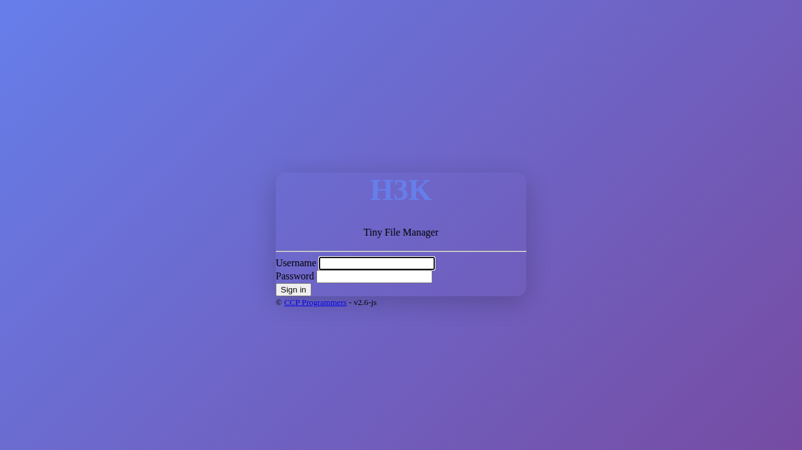
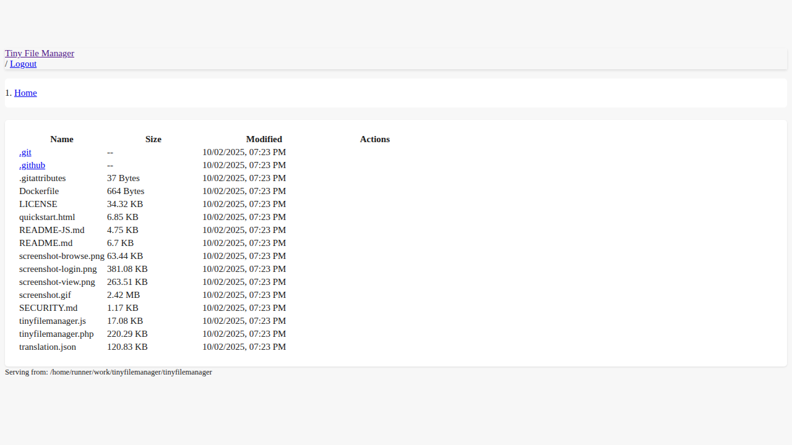
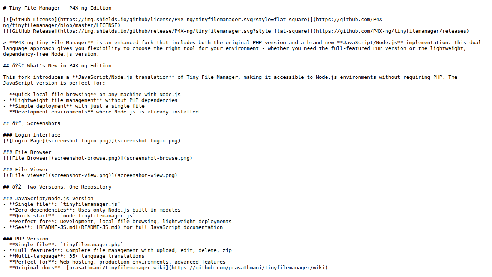

# Tiny File Manager - P4X-ng Edition

[](https://github.com/P4X-ng/tinyfilemanager/blob/master/LICENSE)
[](https://github.com/P4X-ng/tinyfilemanager/releases)

> **P4X-ng Tiny File Manager** is an enhanced fork that includes both the original PHP version and a brand-new **JavaScript/Node.js** implementation. This dual-language approach gives you flexibility to choose the right tool for your environment - whether you need the full-featured PHP version or the lightweight, dependency-free Node.js version.

## 🚀 What's New in P4X-ng Edition

This fork introduces a **JavaScript/Node.js translation** of Tiny File Manager, making it accessible to Node.js environments without requiring PHP. The JavaScript version is perfect for:

- **Quick local file browsing** on any machine with Node.js
- **Lightweight file management** without PHP dependencies
- **Simple deployment** with just a single file
- **Development environments** where Node.js is already installed

## 📸 Screenshots

### Login Interface
[](screenshot-login.png)

### File Browser
[](screenshot-browse.png)

### File Viewer
[](screenshot-view.png)

## 🎯 Two Versions, One Repository

### JavaScript/Node.js Version
- **Single file**: `tinyfilemanager.js`
- **Zero dependencies**: Uses only Node.js built-in modules
- **Quick start**: `node tinyfilemanager.js`
- **Perfect for**: Development, local file browsing, lightweight deployments
- **See**: [README-JS.md](README-JS.md) for full JavaScript documentation

### PHP Version  
- **Single file**: `tinyfilemanager.php`
- **Full featured**: Complete file management with upload, edit, delete, zip
- **Multi-language**: 35+ language translations
- **Perfect for**: Web hosting, production environments, advanced features
- **Original docs**: [prasathmani/tinyfilemanager wiki](https://github.com/prasathmani/tinyfilemanager/wiki)

## 📋 Quick Start

### JavaScript/Node.js Version

**Requirements:** Node.js 12.0 or higher (no additional packages needed)

```bash
# Download and run
curl -O https://raw.githubusercontent.com/P4X-ng/tinyfilemanager/master/tinyfilemanager.js
node tinyfilemanager.js

# Access at http://localhost:8080
# Default login: admin / admin@123
```

See [README-JS.md](README-JS.md) for more options.

### PHP Version

**Requirements:** PHP 5.5.0 or higher (Fileinfo, iconv, zip, tar and mbstring extensions recommended)

```bash
# Download and deploy
curl -O https://raw.githubusercontent.com/P4X-ng/tinyfilemanager/master/tinyfilemanager.php
# Upload to your web server
```

**Setup:**

1. Copy `tinyfilemanager.php` to your webspace
2. Default credentials: **admin/admin@123** and **user/12345**
3. ⚠️ **Important**: Set your own username and password in `$auth_users` before use

Password is encrypted with `password_hash()`. Generate new hash [here](https://tinyfilemanager.github.io/docs/pwd.html).

**Configuration:**
- Enable/disable authentication: Set `$use_auth` to true or false
- Custom config: Add [config.php](https://tinyfilemanager.github.io/config-sample.txt) in the same folder
- Offline mode: Use [offline branch](https://github.com/prasathmani/tinyfilemanager/tree/offline) to work without CDN

## ✨ Features Comparison

### JavaScript Version Features
- ✅ **File Browsing**: Navigate directories with breadcrumb navigation
- ✅ **File Download**: Download files directly
- ✅ **File Viewing**: Preview text files, images, and more
- ✅ **Authentication**: Simple login system
- ✅ **Responsive UI**: Bootstrap 5 interface
- ✅ **Zero Config**: Works out of the box

### PHP Version Features (Full Feature Set)

- 📁 **Complete File Management**: Create, delete, modify, view, download, copy, and move files
- ⬆️ **Advanced Upload**: Ajax uploads with drag-and-drop, URL imports, multi-file with filtering
- 📂 **Folder Operations**: Create and organize folders effortlessly  
- 🗜️ **Compression Tools**: Compress and extract `zip` and `tar` archives
- 👥 **User Permissions**: User-specific root folders and session-based access control
- 📋 **Code Editor**: Cloud9 IDE with 150+ languages and 35+ themes syntax highlighting
- 📄 **Document Preview**: Google/Microsoft viewer for PDF/DOC/XLS/PPT (up to 25 MB)
- 🔒 **Security**: Backup capabilities, IP blacklisting, and whitelisting
- 🔍 **Search**: Fast file search and filtering with DataTables.js
- 🌐 **Multi-language**: Translations in 35+ languages
- 🎨 **Customizable**: Exclude folders/files, customize listings
- 📱 **Mobile Friendly**: Optimized for touch devices
- 🔗 **Direct URLs**: Easy file URL copying

## 🐳 Docker Deployment

For PHP version: [Deploy by Docker](https://github.com/prasathmani/tinyfilemanager/wiki/Deploy-by-Docker)

## 📚 Documentation

- **JavaScript Version**: See [README-JS.md](README-JS.md)
- **PHP Version**: [Wiki pages](https://github.com/prasathmani/tinyfilemanager/wiki)

## ⚠️ Security Notice

**Important**: This tool is designed for development and personal use. If deploying in production:

- Change default passwords immediately
- Use HTTPS (for PHP: configure your web server; for JS: use a reverse proxy)
- Implement proper firewall rules
- Don't expose directly to the internet without protection
- Remove from server when not actively needed

## 📜 License & Credits

- **License**: Available under the [GNU General Public License](https://github.com/P4X-ng/tinyfilemanager/blob/master/LICENSE)
- **Original PHP Version**: [prasathmani/tinyfilemanager](https://github.com/prasathmani/tinyfilemanager) by [CCP Programmers](https://tinyfilemanager.github.io/)
- **Original Concept**: [github.com/alexantr/filemanager](https://github.com/alexantr/filemanager)
- **JavaScript Translation**: P4X-ng fork maintainers
- **CDN Libraries**: jQuery, Bootstrap 5, Font Awesome, Highlight.js, Ace Editor, DropZone.js, DataTables.js

## 🤝 Contributing

Issues and pull requests are welcome! 

- For JavaScript version issues: File here in this repository
- For PHP version issues: Consider contributing to [upstream repository](https://github.com/prasathmani/tinyfilemanager)

## 🔗 Links

- [Original Tiny File Manager](https://github.com/prasathmani/tinyfilemanager)
- [PHP Version Wiki](https://github.com/prasathmani/tinyfilemanager/wiki)
- [Live Demo (PHP)](https://tinyfilemanager.github.io/demo/)

---

<sub>**Note**: The JavaScript version is a simplified implementation focused on core file browsing and viewing features. For full file management capabilities (upload, edit, delete, zip), use the PHP version.</sub>
